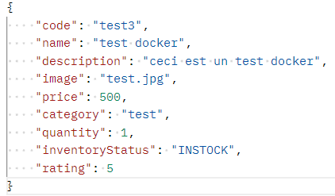
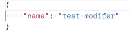

# Back-end

## Autheur

CHAPLAIS Alexandre

## Mise en place du back-end

Pour mettre en place le back-end :

1. Dans le dossier "back", exécutez la commande `docker-compose up -d` pour démarrer la base de données MySQL.
2. Lancez le service **AltenTestApplication**.

La base de données est maintenant active avec les données implémentées via le fichier "products.json".

### Tests

Les tests des services ont été effectués dans la classe **ProductServiceTests** présent dans le dossier "test". 
De plus, les endpoints ont été testés à l'aide de Postman.
Le fichier Postman est disponible dans le dossier "back" sous le nom **Alen.postman_collection.json**.

|                | exemple                 | commentaire                |
|----------------|-------------------------|----------------------------|
| HTTP Request   | **GET** {host}/products | Récupère tous les produits |
| HTTP Response  | 200 - OK                | La requête a réussi        |

  

|               | exemple                                 | commentaire         |
|---------------|-----------------------------------------|---------------------|
| HTTP Request  | **POST** {host}/products                | Crée un produit     |
| Request Body  |  |                     |
| HTTP Response | 200 - OK                                | La requête a réussi |

  

|                | exemple                             | commentaire                               |
|----------------|-------------------------------------|-------------------------------------------|
| HTTP Request   | **GET** {host}/products/{productID} | Récupère le produit qui a l'id donné      |
| HTTP Response  | 200 - OK                            | La requête a réussi                       |
| HTTP Response  | 404 - Not Found                     | L'id n'est pas connu de la base de donnée |

  

|               | exemple                                  | commentaire                                           |
|---------------|------------------------------------------|-------------------------------------------------------|
| HTTP Request  | **GET** {host}/products/{productID}      | Récupère le produit qui a l'id donné pour le modifier |
| Request Body  |  |                                                       |
| HTTP Response | 200 - OK                                 | La requête a réussi                                   |
| HTTP Response | 404 - Not Found                          | L'id n'est pas connu de la base de donnée             |

  

|                | exemple                             | commentaire                               |
|----------------|-------------------------------------|-------------------------------------------|
| HTTP Request   | **DEL** {host}/products/{productID} | Supprime le produit qui a l'id donné      |
| HTTP Response  | 200 - OK                            | La requête a réussi                       |
| HTTP Response  | 404 - Not Found                     | L'id n'est pas connu de la base de donnée |

## Liaison avec le front-end

Une fois le back-end lancé, suivez ces étapes pour connecter le front-end :

1. Dans un terminal, accédez au dossier "front".
2. Lancez la commande `ng serve` pour démarrer le front-end.
3. Les données sont récupérées si le back-end est en cours d'exécution.

### Tests

Pour les tests avec le front-end :

Tests réussis 
- Récupération des données depuis le back-end.
- Possibilité de créer un produit.

Tests non réussis 
- Modification d'un produit.
- Suppression d'un produit.